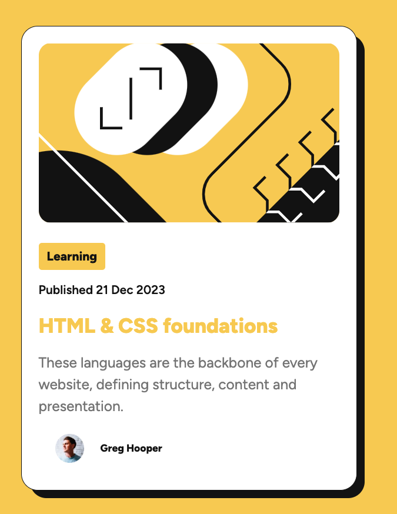

# Frontend Mentor - Blog preview card solution

This is a solution to the [Blog preview card challenge on Frontend Mentor](https://www.frontendmentor.io/challenges/blog-preview-card-ckPaj01IcS). Frontend Mentor challenges help you improve your coding skills by building realistic projects. 

## Table of contents

- [Frontend Mentor - Blog preview card solution](#frontend-mentor---blog-preview-card-solution)
  - [Table of contents](#table-of-contents)
  - [Overview](#overview)
    - [The challenge](#the-challenge)
    - [Screenshot](#screenshot)
    - [Links](#links)
  - [My process](#my-process)
    - [Built with](#built-with)
    - [What I learned](#what-i-learned)
  - [Author](#author)


## Overview

### The challenge

Users should be able to:

- See hover and focus states for all interactive elements on the page

### Screenshot



### Links

- Solution URL: [Solution] (https://www.frontendmentor.io/solutions/blog-preview-card-with-css-and-react-Di4-VwfcUK)
- Live Site URL: [Netlify](https://incandescent-crostata-eb6051.netlify.app)

## My process

### Built with

- Semantic HTML5 markup
- CSS custom properties
- Flexbox
- Mobile-first workflow
- [React](https://reactjs.org/) - JS library


### What I learned

This project built on my skills from the QR code project I'm proud of this shadow I made with an after element


```css
.card::after{
  content: '';
  width: 100%;
  height: 100%;
  border-radius: 1rem;
  background-color: var(--neutral_black);
  position: absolute;
  z-index: -1;
  left: .5em;
  top: .5em;
}
```

## Author

- LinkedIn - [Larry Reaux](https://www.linkedin.com/in/ljreaux/)
- Frontend Mentor - [@ljreaux](https://www.frontendmentor.io/profile/ljreaux)

